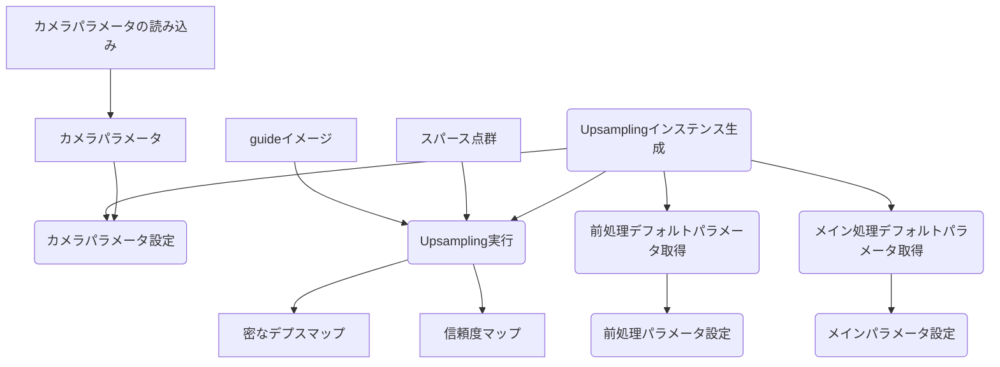
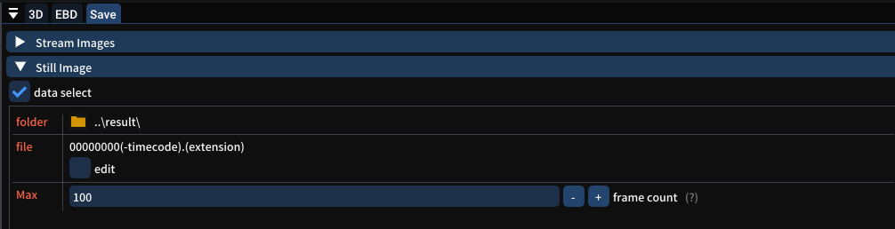
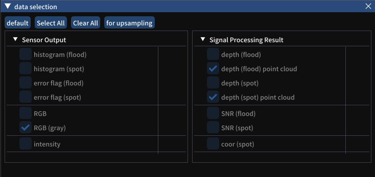
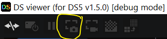
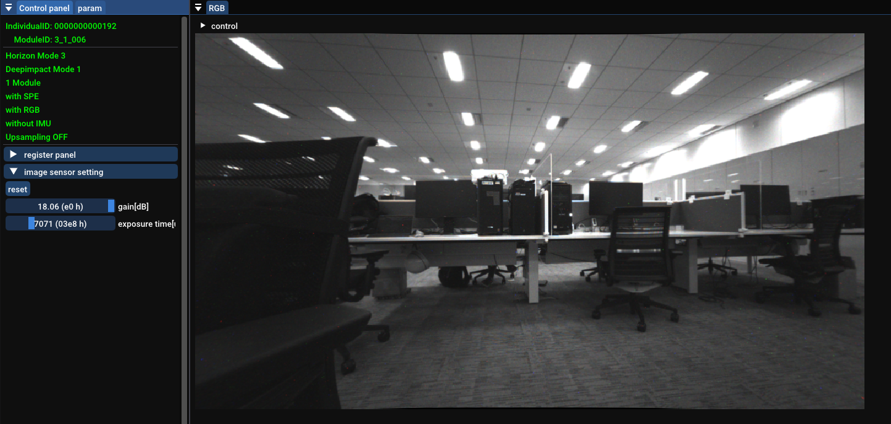

# DS5 Upsampling サンプルコード説明書
## 概要
本ドキュメントは、DS5向けのUpsamplingリリース物（**Upsampling処理のソースコード**と**サンプルコード**）に関する説明書です。\
* Upsampling処理のソースコード
  * Upsamplingクラス、APIと処理の中身があります。
  * Guideイメージを参照し、入力のスパース点群からGuideイメージと同じ解像度の密なデプスマップと信頼度マップを出力します。
  * ユーザから前処理とメイン処理パラメータ設定により、Upsamplingの結果（精度、処理時間）が変わります。
* |サンプルコード
  * UpsamplingクラスAPIの使用例です。
  * パラメータ調整結果を確認できます。


本ドキュメントの構成は以下となります。
* 用語と更新例歴
* パッケージ構成
* ビルド手順
* 実行・サンプル機能
* Upsampling処理のAPI
* 補足


## 用語・更新履歴
### 用語
| 用語 | 説明|
|:-------:|:---------:|
|Upsampling処理のソースコード   | Upsamplingクラス（APIと処理の中身）|
|サンプルコード                 | UpsamplingクラスAPIの使用例|
|DSViewer                     | 別途で提供する実機データを撮るツール|
|Guideイメージ　              |カメラセンサーからのグレイスケール画像（解像度:960x540）|
|スパース点群                 |dToFからの３次元点座標(spotとfloodの解像度が異なる)|
|flood                      |dToFからの密な点群（解像度:80x60）|
|spot                       |dToFからの疎な点群（解像度:12x12）|
|密なデプスマップ                 |Upsamplingの出力画像、画素値がZ値（解像度:960x540）|
|信頼度マップ                   |Upsamplingの出力画像、画素値がデプスマップの信頼度（解像度:960x540）|
|前処理                         |点群からデプスマップへの変換、視差ズレあるところの処理など|
|メイン処理                     |Guideイメージを参照し、スパースのデプスマップを密にする処理|
|カメラパラメータ               |事前キャリブレーションからのパラメータ。点群とデプスマップの変換用|

### 更新履歴
* 2022/8/8 (ver 1.0)　初期バージョン


## パッケージの構成
リリース物の構成は以下となります。\
\<Release PATH> \
├── CMakeLists.txt # コンパイルファイル　\
├── Readme.pdf # 本文\
├── bin # コンパイル生成実行ファイル　\
├── build # コンパイル生成オブジェクトファイル　\
├── conf # コンパイル設定 \
├── dat # テストデータ・カメラパラメータ \
├── inc # OpenCV include \
├── lib # OpenCV lib（ビルド済） \
└── src \
&emsp;&emsp;    ├── CMakeLists.txt \
&emsp;&emsp;    ├── common # 保存フィアルの読み込み・描画用 \
&emsp;&emsp;    ├── sample.cpp # サンプルコード　\
&emsp;&emsp;    └── upsampling # Upsamplingソースコード

## ビルド手順
* 動作確認環境：
  * Windows 10 64bit Enterprise (21H2 19004)
  * Visual Studio 2019
  * CMake 3.23.0
* OpenCVのビルド（Optional）
  * **ビルドしない場合、リリース物にビルド済のlibをご利用ください。**
  * [OpenCV4.1.0をCMakeを使って導入する方法](https://qiita.com/sanishi_pompom/items/02b158dfad3a5dafd0a1#:~:text=OpenCV%201%20%E4%B8%8B%E8%A8%98Git%E3%81%8B%E3%82%89%E3%83%90%E3%83%BC%E3%82%B8%E3%83%A7%E3%83%B3%E3%82%92%E7%A2%BA%E8%AA%8D%E3%81%97%E3%81%A6.zip%E3%83%80%E3%82%A6%E3%83%B3%E3%83%AD%E3%83%BC%E3%83%89%E3%81%97%E3%81%BE%E3%81%99%E3%80%82%20%E4%BB%BB%E6%84%8F%E3%81%AE%E5%A0%B4%E6%89%80%E3%81%AB%E5%B1%95%E9%96%8B%E3%81%97%E3%81%BE%E3%81%99%E3%80%82%20...%202%20CMake%20%28GUI%29%E3%82%92%E8%B5%B7%E5%8B%95%E3%81%97%E3%80%81OpenCV%E3%81%AEDIR,%E8%A8%AD%E5%AE%9A%E3%81%97%E3%81%9F%E3%83%91%E3%82%B9%E3%81%AB%E5%87%BA%E5%8A%9B%E3%81%95%E3%82%8C%E3%81%9F.sln%E3%82%92Visual%20Studio%E3%81%A7%E9%96%8B%E3%81%8D%E3%81%BE%E3%81%99%E3%80%82%20...%205%20ALL_BUILD%E3%82%92%E5%8F%B3%E3%82%AF%E3%83%AA%E3%83%83%E3%82%AF%E3%81%97%E3%81%A6%E3%83%93%E3%83%AB%E3%83%89%206%20INSTALL%E3%82%92%E5%8F%B3%E3%82%AF%E3%83%AA%E3%83%83%E3%82%AF%E3%81%97%E3%81%A6%E3%83%93%E3%83%AB%E3%83%89%20%E3%81%9D%E3%81%AE%E4%BB%96%E3%81%AE%E3%82%A2%E3%82%A4%E3%83%86%E3%83%A0)と[opencv_contrib 4.1.0をCMakeを使って導入する方法](https://qiita.com/sanishi_pompom/items/5191aeca8d6de3e98595)にご参考ください。
  * 必要：contrib、openexr、tiffへのサポート
* サンプルコードのビルド
  * 以下のコマンド(PowerShellの下)を実行すると、実行ファイルがbinフォルダに生成します。
```shell
> mkdir build
> cd build
> cmake ..　
> cmake --build . --config Release --target upsampling_sample -j 10
```
## 実行・サンプル機能
* 実行
```shell
> cd bin\Windows_64_Release
> (optional) ls # opencv_world412.dllを確認してください
> .\upsampling_sample.exe　#　下記の画面が出ます。
```


* サンプル機能
  * パラメータ調整
    * 上から10つのTrackbarで、メインパラメータが調整できる。（詳細について、[「パラメータ説明」](#パラメータ説明)にご参考ください。
  * 表示
    * Trackbarの下に３つの画像が横に並んで表示されます。（4K以下の解像度のディスプレイで一部が表示できない可能性があります。その場合、コードを編集し、一枚画像を表示しないようにしてください。編集方法について、[「描画変更方法」](#描画変更方法)にご参考ください。）
    * 連続フレームがループで生成されます。
    * 左側：入力guide画像、実際に利用しているflood点
    * 中央：Upsamplingから出力した密なのデプスマップとguideイメージと重ねる画像
    * 右側：信頼度の高いUspampling結果とguideイメージと重ねる画像。（[信頼度によるフィルタリング](#信頼度によるフィルタリング)にご参考ください。）
  * キー入力
    * 表示Windowがキーボードからの入力に対する反応です。
    * 「p」連続フレーム再生中止/再開
    * 「s」現在のフレームの処理結果の保存
      * 保存場所：入力場所と同じです。
      * ファイル名：(xxxxxxxはフレーム番号です。)
        * xxxxxxxx_dmap.tiff: 密なデプスマップ 
        * xxxxxxxx_conf.tiff: 信頼度マップ
    * 「r」パラメータリセット（デフォルト値へ戻る）
    * 「q」アプリ終了
    * 「1」「2」「3」入力モード変更（テストデータにはspotとfloodを両方用意しております。spotデータがないと、「2」と「3」が無効になります。）
      * 「1」floodのみ入力
      * 「2」spotのみ入力
      * 「3」floodとspot両方入力


## Upsamplingインターフェイス
### API
UpsamplingクラスのPublic関数と構造体に対応。
  |名前              | タイプ |　説明 |
  |:----------------------|:-----|:----------------:|
  |set_cam_paramaters    |関数  |カメラパラメータの設定|
  |set_upsampling_parameters|関数|メイン処理パラメータの設定|
  |get_default_upsampling_parameters   |関数| メイン処理デフォルトパラメータの取得    |
  |set_preprocessing_parameters          |関数|　前処理パラメータの設定|
  |get_default_preprocessing_parameters   |関数| 前処理デフォルトパラメータの取得|
  |run                      |関数  | Upsamplingの実行（前処理とメイン処理）|
  |get_flood_depthMap       |関数  | 入力floodデプスマップの取得|
  |get_spot_depthMap        |関数　|入力spotデプスマップの取得|
  |depth2pc                 |関数  |デプスマップから点群への変換（未使用）|
  |Upsampling_Params|構造体|メイン処理パラメータ|
  |Preprocessing_Params|構造体|前処理パラメータ|
  |Camera_Params|構造体|カメラパラメータ|

### APIの使用流れ
* 使用流れは以下となります。

{:/comment}

* 対応のサンプルコードは以下となります。
``` cpp
// カメラパラメータの読み込み
map<string, float> params; 
if(!read_param(strParam, params)) { // strParam: カメラパラメータファイル
    cout << "open param failed" <<endl;
    exit(0);
}
float cx, cy, fx, fy;
get_rgb_params(params, cx, cy, fx, fy);
// Upsamplingインステンス生成
upsampling dc;
// カメラパラメータ設定
Camera_Params cam_params(cx, cy, fx, fy);
dc.set_cam_paramters(cam_params);
// メイン処理のデフォルトパラメータの取得
Upsampling_Params upsampling_params;
dc.get_default_upsampling_parameters(upsampling_params);
// 前処理のデフォルトパラメータの取得
Preprocessing_Params preprocessing_params;
dc.get_default_preprocessing_parameters(preprocessing_params);
// メイン処理パラメータの設定
dc.set_upsampling_parameters(upsampling_params); 
// 前処理パラメータの設定
dc.set_preprocessing_parameters(preprocessing_params);
// Upsampling実行
// denseとconfが出力の密なデプスマップと信頼度マップ
// pcSpotがない時、cv::Mat()を入力
dc.run(imgGuide, pcFlood, pcSpot, dense, conf);
```


### パラメータ説明
* 前処理パラメータ
  |パラメータ              | タイプ |範囲 | 説明 |
  |:----------------------|:-----|:------:|:----:|
  |z_continuous_thresh       |float| 0~1 | デプス上近隣判断閾値。小さければ小さいほど、消す点数が多い。 |
	|occlusion_thresh          |float|  0~20   | 視差ズレ判断閾値。大きければ大きいほど、消す点数が多い。 |
	|guide_edge_dilate_size    |int| 1~10 	  | エッジ周りの消しピック数    |
  |canny_thresh1              |int| 0~255| Cannyエッジ抽出のthreshold1|
	|canny_thresh2              |int| 0~255    | Cannyエッジ抽出のthreshold2|
	|range_flood                |int  | 2~40     | floodに対するUpsamplingの範囲、処理スピードに影響なし |
* 注意点
  * canny_thresh1 > canny_thresh2の場合、guideのエッジ処理が無効になる。処理が早くる。
  * z_continuous_thresh=1 且つ occlusion_thresh=20の場合、depthエッジ処理が無効になる。処理が早くなる。

* メイン処理パラメータ
  |パラメータ              | タイプ |範囲 | 説明 |
  |:----------------------|:-----|:------:|:----:|
  |fgs_lambda_flood       |float| 0.1~100 | 空間分解能 |
	|fgs_sigma_color_flood  |float|  1~20   | 色空間分解能 |
	|fgs_lambda_attenuation |float| 0.25 	  | 固定値   |
  |fgs_lambda_spot        |float| 1~1000  | 固定値 |
	|fgs_sigma_color_spot   |float| 1~20    | 固定値 |
	|fgs_num_iter_flood     |int  | 1~5     | iteration回数、大きければ大きいほど、スピードが遅くなる |
	|fgs_num_iter_spot      |int  | 1~5     | 固定値 |
* 注意点
  * サンプルアプリには、floodに関するパラメータのみ調整しております。spotに関するパラメータを固定しております。

## 補足
### DSViewerでのファイル保存
* 以下の手順でguideイメージ、スパース点群ファイルが保存できます。
  * DSViewerを起動、デバイスと接続
  * 画面右のWindowの<kbd>save</kbd>タブを選択。（下記の画像）frame countを設定

  * <kbd>data select</kbd>にチェック。次の画面に（下記の画像）<kbd>for upsampling</kbd>タブを選択してから、Windowを閉じる。

  * 左上のメニュー（下記の画像）の<kbd>save still image</kbd>ボタンを押すと、録画開始



* DSViewerの具体的な使用方法について、DSViewerのドキュメントにご参考ください。

### guideイメージの明るさ調整
guideイメージの明るさはupsamplingへの影響があります。
明るい方がおすすめです。\
DSViewerでのファイル保存の前、調整する必要があります。
* 調整方法：
  * DSViewerがデバイスと接続してから、左のWindow（下記の画像）から、「image sensor setting」の「gain」を大きくしてください。隣のWindowで確認できます。


### カメラパラメータファイル取得方法
Upsamplingサンプルコードに使用するカメラパラメータファイル（ファイル名が<kbd>strParam</kbd>変数に保存）が
データ撮りのデバイスと一致する必要があります。\
DSViewerにカメラパラメータファイルがあり（下記の場所）、指定場所にコピーしてご使用ください。
```shell
<DSViewer Root Path>\data\master\param\camera_calib\param.txt
```


### 描画変更方法
ディスプレイの解像度が4K以下になる場合、表示画像の一部が見えない可能性があります。\
<kbd>sample.cpp</kbd>ファイルの<kbd>visualization()</kbd>関数には描画に関する部分(下記のコード)を修正してください。
```cpp
// draw images and labels 
vector<cv::Mat> vecImgs;
vector<string> vecLabel;
char szLabel[255];
if (mode == '1' || mode == '3') { 
    vecImgs.push_back(imgGuideMapFlood);
    sprintf(szLabel, "flood (FPS = %.2f)", g_FPS);
    vecLabel.push_back(szLabel);
} else {
    vecImgs.push_back(imgGuideMapSpot);
    sprintf(szLabel, "spot (FPS = %.2f)", g_FPS);
    vecLabel.push_back(szLabel);
}
vecImgs.push_back(imgOverlapDense); // show dense depthmap
vecLabel.push_back("dense");
vecImgs.push_back(imgOverlapFiltered); // show dense depthmap filtered by confidence
vecLabel.push_back("filtered");
return mergeImages(vecImgs, vecLabel, cv::Size(3, 1)); // 3 images in 1 line
```
* 方法１：２枚だけ表示
  * <kbd>vecImgs</kbd>に2枚の画像のみ<kbd>push_back</kdb>
  * 最後の一行の<kbd>cv::Size(2,1)</kbd>に変更
* 方法２：２行分けで表示
  * 最後の一行の<kbd>cv::Size(2,2)</kbd>に変更

### 信頼度によるフィルタリング
Upsamplingの機能ではありません。サンプルアプリには、Upsampling後に信頼度の高いデプスマップのみ残る処理を実現しました。また、信頼度閾値を調整し、結果を確認することができます。


