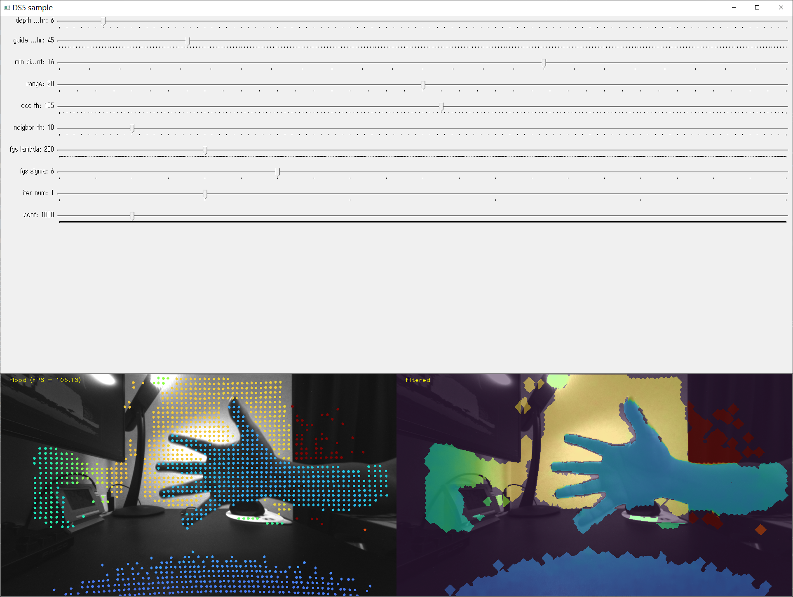

# DS5 Upsampling サンプルコード
## 概要
DS5向けの**Upsampling処理のソースコード**と**サンプルアプリソースコード**です。
* Upsampling処理のソースコード
  * Upsamplingクラス
  * Guideイメージを参照し、入力のスパース点群からGuideイメージと同じ解像度のデプスマップと信頼度マップを出力します。
  * ユーザから前処理とメイン処理パラメータ設定により、Upsamplingの結果（精度、処理時間）が変わります。
* サンプルコード
  * UpsamplingクラスAPIの使用例です。
  * テストデータを利用し、パラメータ調整と効果を示すサンプルです。
* その他
  * テストデータ。DSViewerで保存した連続フレームセット（「DSViewerでの保存ファイル」に参考）
  * カメラパラメータ。保存用の実機のカメラパラメータ（「パラメータファイル取得方法」に参考）
* 動作確認環境：
  * Windows 10 64bit Enterprise (21H2 19004)


## 更新履歴
* 2022/8/8 (ver 1.0)　初期バージョン


## パッケージの構成
├── CMakeLists.txt # コンパイルファイル　\
├── Readme.md # 本文\
├── bin # コンパイル生成実行ファイル　\
├── build # コンパイル生成オブジェクトファイル　\
├── conf # コンパイル設定 \
├── dat # テストデータ・カメラパラメータ \
├── inc # OpenCV include \
├── lib # OpenCV lib \
└── src \
&emsp;&emsp;    ├── CMakeLists.txt \
&emsp;&emsp;    ├── common # 保存フィアルの読み込み・描画用 \
&emsp;&emsp;    ├── sample.cpp # サンプルコード　\
&emsp;&emsp;    └── upsampling # Upsamplingソースコード

## ビルド手順
* OpenCVのビルド
  * 略
  * 必要：contrib、openexr、tiffへのサポート
* サンプルコードのビルド
  * 以下のコマンド(PowerShellの下)を実行すると、実行ファイルがbinフォルダに生成します。
```shell
> mkdir build
> cd build
> cmake ..　
> cmake --build . --config Release --target upsampling_sample -j 10
```
## 実行・サンプル機能
* 実行
```shell
> cd bin\Windows_64_Release
> (optional) ls # opencv_world412.dllを確認してください
> .\upsampling_sample.exe　#　下記の画面が出ます。
```



* サンプル機能
  * パラメータ調整
    * 上から10つのTrackbarで、メインパラメータが調整できる。（「パラメータ説明」にご参考ください）
  * 表示
    * Trackbarの下に３つの画像が横に並んで表示されます。（4K以下の解像度のディスプレイで一部が表示できない可能性があります。その場合、コードを編集し、一枚画像を表示しないようにしてください。編集方法について、「描画変更」にご参考ください。）
    * 連続フレームがループで生成されます。
    * 左側：入力guide画像、実際に利用しているflood点
    * 中央：Upsamplingの結果（denseのデプスマップとguideと重ねる画像）
    * 右側：信頼度（Confidence）の高いUspampling結果
  * キー入力
    * 表示Windowがキーボードからの入力に対する反応です。
    * 「p」連続フレーム再生中止/再開
    * 「s」現在のフレームの処理結果の保存


## パラメータ説明


