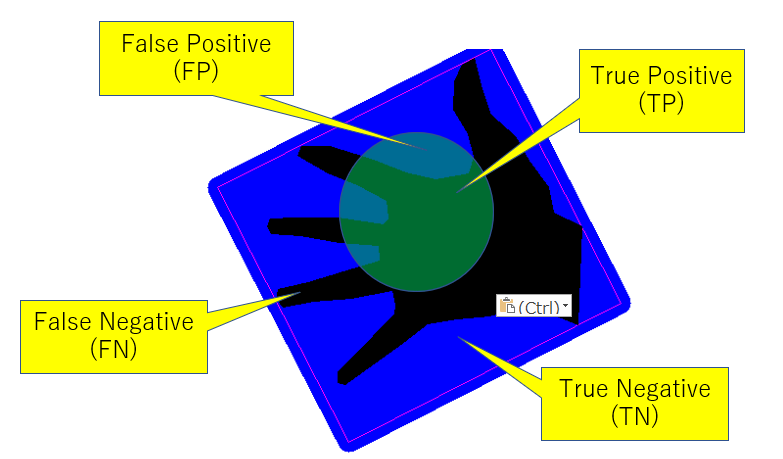

# DS5を用いるAR向けのデプスUpsamplingアルゴリズム開発
----
## 1.概要
本ドキュメントは、DS5を用いるAR応用に向け、Upsamplingアルゴリズム開発に関するレポートである。 
スマートフォンが普及と伴に、性能の高いイメージセンサーへの要求も増えてくる。SSS社がモバイル用のイメージセンサ領域に優勢を取る上に、様々なセンシング技術に取り組んでいる。DSシリーズのdToFセンサーがそのうちの一つであり、今年（FY22）に新しいメンバーのDS5がリリースされた。前身のDS4と比べ、測距モードが増え、出力のFPS（Frames Per Second）も改善された。 
一方、AI技術とハードウェアの進歩により、様々なアプリケーションがスマートフォンに搭載されることになった。そのうち、AR（Augmented Reality）が一つの注目されてる応用であり、これから産業に活躍になると期待されている。しかし、ARの応用には高い解像度のデプス出力が求められ、dToFでの測距点の密度ではなかなか満足できない。そのため、スパースな測距データを密な信号に補完するデプスUpsampling（後では、Upsamplingと呼ぶ）という技術に頼ることになる。

今まで用途に応じで幾つのUpsampling方法を開発したが、ARの用途が初めてある。本開発は、ARの開発先からの要求を満たし、DS5の特性に合わせるUspamplingアルゴリズムが目的である。 
本レポートは、以下の構成となる。 
* 第２章は、DS5、AR、Uspamplingの紹介である。
* 第３章では、開発目標と設計方針について述べる。
* 第４章では、アルゴリズムの検討と設計について説明する。
* 第５章は、実装とパラメータの説明である。
* 第６章では、検証方法と結果を紹介する。
* 最後は、まとめである。

## 2. 関連技術
### 2.1 DS5
* 概要
DS5は、MIS保有の「Horizon（高解像度SPAD）、OCL月VCSEL」と広FOVレンズにより、1Tx & 1Rx構成で近距離高解像度depthと中長距離depthの実現が可能な測距システムである。DS5で使用するデバイスとスペックについて、下記の表をご参考ください。図1にのように、DS5モジュールにRGBセンサー（GS）とdToFセンサー（RX）が横に並んである。

表1. DS5で使用するデバイス

| デバイス | 型番 | スペック |
| --- | --- | --- |
| ToF Rx   | Horizion              | 4800MP SPAD    |
| ToF Tx   | S6893B w/ OCL         | 432ch for Flood, 144ch for Spot, FOV:$100{\degree}$(H) $83.6{\degree}$(V) |
| RGB sensor | Deep Imapct (B/W), GS | 2Mpix, 120fps, FOV:$109.6{\degree}$(H) $71.9{\degree}$(V)   |
  
図1. DS5評価環境

* 出力
DS5の評価環境は図1のようになる。DS5モジュールから撮った元信号が中継基板を経由、DSY-01という基盤で信号処理を行ってから、USBケーブルを経由しPCに送信する。現段階ではUpsamplingがPC側で行う。
PCへの出力データは以下となる（図2に出力の例を示している）。
  * flood ポイントクラウド：近距離測距による$80 \times 60$点のポイントクラウド
  * spot ポイントクラウド：遠距離測距による$12 \times 12$点のポイントクラウド
  * RGB 画像：解像度が$960 \times 540$である白黒画像
  * intensity：解像度が$320 \times 240$である白黒画像

  図2. DS5出力の例 (左から順に、RGB画像、intensity画像、floodデプスマップ、spotデプスマップ。ただし、intensity, flood, spotの値により正規化を行った) 
  
  
  ### 2.2 AR
* セグメンテーションのタスク
図3に示す例のように、ARは現実世界の情報を認識し、バーチャルの情報を現実世界に重ね合わせて表示する技術である。そのため、複雑な背景から目標物体を綺麗に取り出すこと、いわゆるセグメンテーションが臨場感に関わるキーポイントである。
デプス情報を利用するセグメンテーションは、処理の軽い又は精度の高いというメリットがある。ただし、高い密度のデプスが必要となる。

図3. ARの例（左：現実世界、右：バーチャル情報での拡張）

* 入力デプスに対する要求
実用のため、入力デプスの解像度のみならず、フレームレートと精度にも要求がある。
* スピード
動画像からのセグメンテーションの場合、出力スピードが低いと遅延が発生し、ユーザーエクスペリエンスに影響を与える重要な指標の一つである。
出力スピードに対して、100 FPS以上が望ましい。
* 精度
デプスの精度を評価する時、MAE（Mean Absolute Error）などの各ピクセルの誤差がよく使われている。ただし、セグメンテーションの場合、全体より、エッジ部分が最も重視される。すなわち、エッジ部分の綺麗さが大事なことである。
本開発には、AR技術開発先が利用するRecallとPrecisionでの評価指標を参考し、セグメンテーションに対する評価を行った。詳細について、[[#6 検証・評価]]にご参考ください。

### 2.3 デプスUpsampling
* 概説
デプスUpsampling（Depth Completionと同じこと。以下には、Upsamplingと呼ぶ）技術は、密な信号（guide画像）を参考し、スパースなデプス入力を密にする方法である。
Depth Completionも呼ばれて、多くの手法（[KITTY Depth Completion Benchmark]([KITTI Depth Completion Benchmark (Depth Completion) | Papers With Code](https://paperswithcode.com/sota/depth-completion-on-kitti-depth-completion))にご参考ください）が提案された。一般的に、DNNベースの手法とフィルタベース手法を分ける。DNNベースの手法では、深層学習方法を利用し、データよりモジュールを訓練する。精度が高いが、計算量が大きいまたはデータに依存する。一方、フィルタベースの手法は、人工設計したルールでのフィルタリング処理である。精度が弱いが、処理スピードが早い。

セグメンテーションの要求と利用環境を考えると、処理の軽いフィルタベースの手法を選んだ。
また、精度とスピードの様々なフィルタベースの方法がある。本開発では、幾つのUpsampling方法の比較を行った上、スピードの早いFGSを使うことにした。Upsampling手法の比較について、[[#4 アルゴリズムの検討]]にご参考ください。

* FGS
D. Minらが[Fast Global Image Smoothing Based on Weighted Least Squares](https://www.researchgate.net/profile/Dongbo-Min/publication/267871655_Fast_Global_Image_Smoothing_Based_on_Weighted_Least_Squares/links/55ad977108ae98e661a4327f/Fast-Global-Image-Smoothing-Based-on-Weighted-Least-Squares.pdf?origin=publication_detail)に提案したEdge-presevering Global Smootherである。詳細について、論文にご参考ください。こちらで、Upsamplingアルゴリズムに調整可能のパラメータ$\lambda$と$\sigma$を理解しやすいため、FGSの原理を簡単に紹介する。

FGSでは、画像全体を配慮し、式(1)で定義されたGlobalエネルギー関数$J(u)$を最小化するような目標画像（$u$）が求められる。
ここで、$p$が画像上のあるピクセルであり、$q$が$p$の隣接領域のピクセルである。そして、$u_p$が目標画像の画素値、$f_p$が入力画像の画素値、$g_p$がguide画像の画素値である。$h_p$がスパース入力のマスクであり、入力ありのところが1、入力なしのところが0になる。
$$
J(u)= \sum_p \left(h_p (u_p-f_p)^2+\lambda\sum_{q\in \mathcal{N}(p)}\omega_{p,q}(g)(u_p-u_q)^2 \right)　\tag {1}
$$
また、$\omega_{p,q}(g)$がguide画像上、$q$と$p$の類似度で、式(2)で算出する。
$$
\omega_{p,q}(g) = \exp(-||g_p-g_q||/\sigma) \tag {2}
$$
式(1)の足し算の前後が分けて、前の部分が入力$f$との差、後ろが周りとの差である。$\lambda$がそのバランスを調整するパラメータである。また、$\sigma$が隣接領域との類似度を調整するパラメータである。

式(1)を最適化し、式(3)の結果になる。$m$がピクセルインデックス。$I$が単位行列であり、$A$ が$\omega$で構成された$S \times S$行列（$S=$画像幅$\times$画像高さ）である.　ちなみに、guide画像より$(I + \lambda A)^{-1}$のフィルタを入力スパースデプスマップ$f$とマスク$h$にそれぞれ掛け、その結果の商を求めることになる。
$$
u(m)=\frac{((I+\lambda A)^{-1}f)(m)}{((I+\lambda A)^{-1}h)(m)} \tag{3}
$$

## 3. 開発方針
利用センサーと応用先の要求に応じで、本開発の方針を決めた。

### 3.1 性能目標 
セグメンテーションの実用を考えると、処理スピードとエッジ部分が最優先である。
フレームレートは120FPSを目標にした。
また、セグメンテーションに使われているRecallとPrecisionの指標を参考し、評価を行った（具体的な評価について、[[#6 検証・評価]]にご参考ください）。
更に、応用環境への適応性のため、調整可能のパラメータを設定し、ユーザが自由に調整できるインターフェイスを用意する設計になった。

### 3.2 利用データ
DS5では、RGB画像以外、モードによりfloodとspotのポイントクラウドまたはintensity画像が出力できる。（[[#2 1 DS5]]にご参考ください）
Upsamplingの入力として、guide画像とデプスマップがある。
今回は、RGB画像をguide画像として、floodポイントクラウドを入力とすることにした。また、RGBとspotポイントクラウドのUpsampling結果を補足として利用することを考えている。
理由は以下となる。
* ARタスクには、近距離の前景と遠距離の背景のセグメンテーションがメインである。近距離のFloodモードがメインだと考えている。
* DS5では、floodとspotを両方出力すると、120FPSに至らない。すなわち、入力が120FPS未満となる。
* spotポイントクラウドは、遠い背景の情報が必要な場合、利用する。

また、RGB画像の代わり、Intensity画像をguideに利用する案もあった。ただし、Intensityの解像度（320x240）が低いので、RGB画像を使用した。

### 3.3 Upsamplingのインターフェイス
UpsamplingモジュールはDS5の出力データの後段処理として、入力はDSY-01基板からのポイントクラウドである。Upsampling処理の入力がデプスマップであるので、入力のポイントクラウドをデプスマップを変換する必要がある。ただし、Upsampling処理の出力が密なデプスマップであり、セグメンテーションに直接に使えるので、ポイントクラウドに変換する必要がない。

また、Upsampling処理がスパースなデプス信号の基に補間するので、元信号との距離による精度が変わる。そのため、Upsamplingの出力として、補間後の信号と伴に、信頼度マップを作った。信頼度が元信号との距離により、0から1に変動させる。詳細について、[[#4 アルゴリズムの検討]]にご参考ください。信頼度を利用して、更に綺麗なセグメンテーションが期待される。（信頼度の閾値によりフィルタリングの結果が図11に示す）

## 4. アルゴリズムの検討
### 4.1 前処理とメイン処理
機能の視点から、Upsamplingモジュールは前処理とメイン処理の２つ部分が分ける。それぞれのタスクは以下となる。
* 前処理
	* ポイントクライド⇒デプスマップ
	* 視差ズレ対策
* メイン処理
	* guide画像によりフィルタ算出
	* 入力とマスクに対するフィルタリング処理
	* 信頼度計算
ただし、前処理が必ずメイン処理の前に実行することではない。処理時間を短縮するため、実装の際前処理とメイン処理が並列に行うことにしている。詳細について、[[#5 実装とパラメータ]]にご参考ください。

### 4.2 メイン処理の検討
まず、処理時間が最もかかる部分のUpsamplingメイン処理を検討した。ここで、信頼度計算を含まずフィルタの算出とフィルタリング処理のみを考えている。
そのため、今まで開発した幾つのUpsampling手法の精度とスピードの比較実験を行った。目的は２つがある：１つ目は、120 FPS（8.33 msec）の目標との距離を把握すること。２つ目は、最適切な手法を選ぶこと。

実験では、シミュレータで生成したCGデータを利用し、以下の４つのUpsampling手法を比較した。
データは、室内の3次元モジュールから50シーンの4つのFOVのRGB画像とデプスマップがある。スパース入力として、デプスマップからDS5とFloodモードと同じ密度で間引いて作成した。
* 比較手法
	* FBS (Fast Bilateral Solver)：ノイズに対する耐性ある手法である。入力はguideとスパースのデプスマップ以外、信頼度マップも必要となる。詳しく[Fast Bilateral Solver](https://arxiv.org/pdf/1511.03296.pdf)にご参考ください
	* FGS (Fast Global Smoother)：スピードの早さが特徴である。
	* WFGS（Weighted FGS）：FGSをベースに、時間安定性を考慮する手法である。
	* PlanarFilter（Planar Filter）：FGSをベースに、平面性を維持する手法である。
評価結果は図4に示す。FGSが最も早いことが分かった。$640 \times 480$の解像度の入力に対して、約5msecで、DS5の解像度（$960x540$）では約7msecになる。全体的な精度（MAE：Mean Absolute Error）には、PlanarFilterに近い良い結果だった。また、どの手法でも、FOVが多ければ大きいほど、精度が落ちる。細かいところが増えいてきたのが原因だと考える。

図4. Upsampling手法の比較

この実験の結果より、FGSを今回に使用することに決めた。また、8.33 msecの目標にわずかの時間差があるので、他の処理にもなるべく軽くしないといけない状況である。

### 4.3 視差ずれの対策
DS5のRGBセンサーとdToFが同軸になっていないため、RGB画像とdToFの測距点を位置合わせる場合、視差ずれが発生する。図.5のように、視差ずれによりエッジのところに誤るポイントがあり、Upsamplingの結果に影響を与える。
特にエッジ部分の劣化が大きいので、対策が必要となる。

図5. 視差ずれの例（左：補正後のfloodモードでのデプスマップ、右：左のデータでのUpsampling結果）

ここで、視差ずれによる誤るポイント（下はずれポイントと呼ぶ）を除去することでの改善案を提案した。具体的に、guide画像とスパース入力からそれぞれずれ可能の部分を推定し、合わせてずれポイントと決める。
スパースな入力ポイントからずれポイントを消し、残りのポイントでUpsampling処理を行う。

 * guide画像からずれポイント検出
エッジのところにずれによるずれポイントが出やすいため、RGB画像のエッジ領域に基いて、ずれポイントを推定する。
具体的に、図6のようにCanny法でRGB画像のエッジ抽出行い、膨張処理を掛けエッジ領域が得る。領域内のポイントをずれポイントとして、削除する。

図6. guide画像のエッジ抽出

  
 * デプスマップからずれポイント検出
RGB画像では、色差によりエッジ抽出しにくいところがあるので、デプス入力にもずれポイント検知処理を行う。
入力のポイントクラウドをデプスマップに変換すれば、図7のようにスパースのデプスマップになる。
ここで、２つの観点からずれポイントを検出する。
(1) スパース入力の位置によるずれポイント検出
DS5のdToFセンサがRGBセンサの右にあり、キャリブレーションしても横方向の位置ずれが残る。
図7の黄色枠に描画するように、ずれポイントは横のポイントとの距離が普通より近い。それをずれポイントの判断条件とする。
(2) デプスの変換によるずれポイント検出
エッジ部分のデプス変換が大きいが、環境が複雑なので絶対距離差の閾値（例えば、5cm）でエッジを判定することが難しい。
ここで、相対距離差で判定ルールを設計した。
具体的に、対象ポイントと左の隣接ポイントとのデプス差を算出し、対象ポイントのデプスとの割合を閾値とする。
ちなみに、遠いところに視差ずれが小さい。

この２つのルールで誤る可能性があるポイントを検出し、同時に判断されたポイントをずれポイントとする。

図7. RGB画像に描画するスパースデプスマップ（黄色枠には誤るポイントと隣の正しいポイントのペア）

### 4.3 信頼度
[[#2 関連技術]]に説明したFGSのアルゴリズムでは、補間後のデプスマップだけ出力される。
しかし、精度に求めるユーザに対して、信頼度情報も必要である。
そのため、Upsampling出力のデプスマップの各ピクセルの信頼度を計算し、信頼度マップを提供することになる。
基本的に、入力のスパースポイント（直接に観測されたポイント）の精度が最も高く、信頼度が高い。
補間結果は入力との距離により、遠ければ遠いほど精度が悪くなり、信頼度が低く設定する。
ただ、各ピクセルと入力ポイントの距離算出に時間かかるので、Upsamplingの中間結果を活用することにした。
具体的に、マスクのフィルタリング結果(式(3)の分母$H$、$H = ((I+\lambda A)^{-1}h(m)$)を利用する。詳細について、[[#2 3 デプスUpsampling]]にご参考ください。
また、パラメータ$\lambda$による変動があるので、結果に$\lambda$を掛け、補正する
最後、扱いやすいため、信頼度の範囲を0~1に設定した。図13に信頼度マップの例を示している。
ユーザが信頼度閾値(0~1)に設定し、信頼度の高いUpsampling結果のみ使うことができる。

## 5. 実装とパラメータ
### 5.1 処理流れ
前の説明のようにUpsamplingが前処理とメイン処理を分けるが、処理スピードのために一部を並列になっている。
具体的な流れは以下となる。ポイントクラウドの処理とRGB画像の処理に情報交換がない部分を並列化する。

ここで、処理1、２、３が並列処理にした。処理１にデプスマップを作成しながら、誤るポイントを判断し除去を行う。

### 5.2 パラメータ調整
パラメータにより、Upsamplingの性能（スピード・精度）が変わることがある。本開発では、AR応用を想定しているが、
具体的なセグメンテーション手法や対象アプリがないため、パラメータチューニングにしていない。
そのため、性能に大きい影響を与えるパラメータをユーザに提供することになる。
調整可能のパラメータを以下の表に示す。
* 前処理パラメータ

| パラメータ             | タイプ | 範囲  | 説明                                                         |
| ----- | ---- | ----- | ------- |
| z_continuous_thresh    | float  | 0~1   | デプス上近隣判断閾値。小さければ小さいほど、消す点数が多い。 |
| occlusion_thresh       | float  | 0~20  | 視差ズレ判断閾値。大きければ大きいほど、消す点数が多い。     |
| guide_edge_dilate_size | int    | 1~10  | エッジ周りの消しピック数                                     |
| canny_thresh1          | int    | 0~255 | Cannyエッジ抽出のthreshold1                                  |
| canny_thresh2          | int    | 0~255 | Cannyエッジ抽出のthreshold2                                  |
| range_flood            | int    | 2~40  | floodに対するUpsamplingの範囲、処理スピードに影響なし        |
  
* メイン処理パラメータ

| パラメータ | タイプ |  範囲   |  説明 |
|:---- |:--- |:---:|:---:|
| fgs_lambda_flood       | float  | 0.1~100 |  空間分解能 |
| fgs_sigma_color_flood  | float  |  1~20   |  色空間分解能 |
| fgs_lambda_attenuation | float  |  0.25   |  固定値 |
| fgs_lambda_spot        | float  | 1~1000  |  固定値 |
| fgs_sigma_color_spot   | float  |  1~20   |  固定値 |
| fgs_num_iter_flood     | int    |   1~5   | iteration回数、大きければ大きいほど、スピードが遅くなる |
| fgs_num_iter_spot      | int    |   1~5   |  固定値 |
  
  
## 6. 検証・評価
### 実験条件
図8のようなDS5で撮影した画像から手のセグメンテーションの実験を行った。
Ground Truth（GT）として、RGB画像から人工でマークした手の領域となる。
そして、図9のようにGT周辺の青い注目領域に、セグメンテーション結果（EST）とGTを比較する。
図8. セグメンテーションの目標

図9. 評価基準

評価基準は以下のPrecisionとRecallになる。
$$
\mathtt{Precision} = \frac{\mathtt{TP}}{FP+TP}
$$
$$
\mathtt{Recall} = \frac{\mathtt{TP}}{TP + FN}
$$

セグメンテーションには、注目領域内の画素$x$のデプス$D(x)$を基いて、閾値$T$によりEST（$D(x) \le T$）と背景（ $D(x) \gt T$ ）を分ける。
実験では、手をデバイスと約$40$cmのところに置き、背景として、$50$cmにある壁と他の物体がある。
一枚の静止画に対して、パラメータをチューニングしました。
評価用PCのスペックは以下となる。GPUを利用していない。
* CPU： AMD 3700x 3.6GHz
* RAM： 64 GB (2666 MHz)

## 実験結果
$T$の変化によるRecallとPrecisionの変換を図.10に示す。この結果から、前処理の効果が分かった。
図11にUpsamplingの入力と出力または信頼度によるフィルタリングの結果を示している。
図12と図13は評価シーンのUpsampling処理後のポイントクラウドと信頼度マップである。
処理スピードは、パラメータにより変わるが、約80～140FPSの範囲内に変化する。

図10. $T$の変化によるROCの結果

図11. Uspamplingの結果の例（上：前処理なし。下：前処理あり。左：入力。中央：Upsamplingの出力。右：信頼度によるフィルタリングの結果）

図12. Upsampling後のポイントクラウド（緑矢印がデバイスの向き方向）

図13. 信頼度マップの例

## 7. まとめ
* 課題・対策
本開発には、AR応用に一つの重要なタスクのセグメンテーションに対して、DS5のUpsamplingアルゴリズム開発を行った。
ユーザからの要求により、処理スピードと視差ずれに対する対策を実施した。
* できたこと
	* スピード：基本的に満たすことできた。
	* 視差ずれ：軽い前処理である程度に抑えた。
* 問題点
	* パラメータの調整：シーンによる最適のものが変わる。
	* 動き物体：RGBとdToFの同期問題で、動き物体に対してRGB画像とデプスとのずれが酷くなる。その場合、今の対応が不十分であり、画質が劣化する。
* 今後の予定
Intensity画像の使用。IntensityがdToFから出力なので、視差ずれがないというメリットがある。
しかし、画質が低下なので、guideとして工夫する必要がある。
また、解像度がQVGAで、更に高い解像度にすることが必要である。

