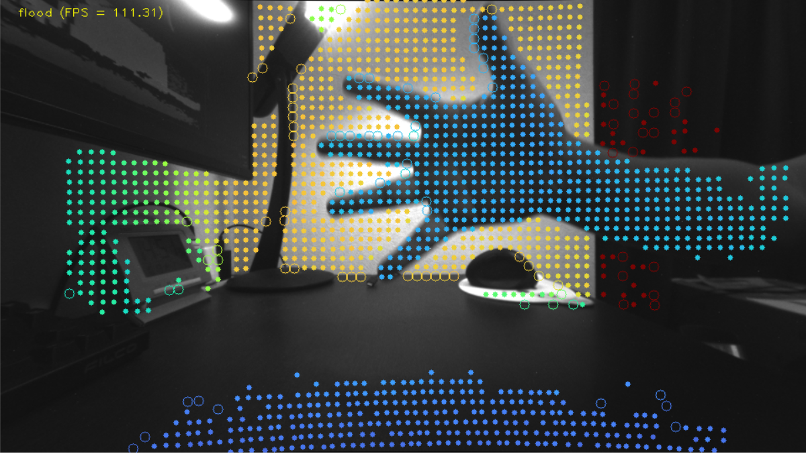

# DS5を用いるAR向けのデプスUpsamplingアルゴリズム開発
----
## 1.概要
本ドキュメントは、DS5を用いるAR応用に向け、Upsamplingアルゴリズム開発に関するレポートである。 
スマートフォンが普及と伴に、性能の高いイメージセンサーへの要求も増えてくる。SSS社がモバイル用のイメージセンサ領域に優勢を取る上に、様々なセンシング技術に取り組んでいる。DSシリーズのdToFセンサーがそのうちの一つであり、FY22に新しいメンバーのDS5がリリースされた。前身のDS4と比べ、測距モードが増え、出力のFPS（Frames Per Second）も改善された。 
一方、AI技術とハードウェアの進歩により、様々なアプリケーションがスマートフォンに搭載されることになった。そのうち、AR（Augmented Reality）が一つの注目されてる応用であり、これから産業に活躍になると期待されている。しかし、ARの応用には高い解像度のデプス出力が求められ、dToFでの測距点の密度ではなかなか満足できない。そのため、スパースな測距データを密な信号に補完するデプスUpsampling（後では、Upsamplingと呼ぶ）という技術に頼ることになる。

今まで用途に応じで幾つのUpsampling方法を開発したが、ARの用途が初めてある。本開発は、ARの開発先からの要求を満たし、DS5の特性に合わせるUspamplingアルゴリズムが目的である。 
本レポートは、以下の構成となる。 
* 第２章は、DS5、AR、Uspamplingの紹介である。
* 第３章では、開発目標と設計方針について述べる。
* 第４章では、アルゴリズムの検討と設計について説明する。
* 第５章は、実装とパラメータの説明である。
* 第６章では、検証方法と結果を紹介する。
* 最後は、まとめである。

## 2. 関連技術
### 2.1 DS5
#### 2.1.1 概要
DS5は、MIS保有の「Horizon（高解像度SPAD）、OCL月VCSEL」と広FOVレンズにより、1Tx & 1Rx構成で近距離高解像度depthと中長距離depthの実現が可能な測距システムである。DS5で使用するデバイスとスペックについて、下記の表をご参考ください。図1にのように、DS5モジュールにグローバルシャッター画像センサー（GS）とdToFセンサー（RX）が横に並んである。

表1. DS5で使用するデバイス

| デバイス | 型番 | スペック |
| --- | --- | --- |
| ToF Rx   | Horizion              | 4800MP SPAD    |
| ToF Tx   | S6893B w/ OCL         | 432ch for Flood, 144ch for Spot, FOV:$100{\degree}$(H) $83.6{\degree}$(V) |
| GS sensor | Deep Imapct (B/W) | 2Mpix, 120fps, FOV:$109.6{\degree}$(H) $71.9{\degree}$(V)   |
  
図1. DS5評価環境

#### 2.1.2 出力
DS5の評価環境は図1のようになる。DS5モジュールから撮った元信号が中継基板を経由、DSY-01という基盤で信号処理を行ってから、USBケーブルを経由しPCに送信する。現段階ではUpsamplingがPC側で行う。
PCへの出力データは以下となる（図2に出力の例を示している）。
  * flood ポイントクラウド（floodモード有効の時）：近距離測距による$80 \times 60$点のポイントクラウド
  * spot ポイントクラウド（spotモード有効の時）：遠距離測距による$12 \times 12$点のポイントクラウド
  * GS画像（GS Sensorの出力）：解像度が$960 \times 540$である白黒画像
  * intensity（intensityモード有効の時）：解像度が$320 \times 240$である白黒画像

  図2. DS5出力の例 (左から順に、GS画像、intensity画像、floodデプスマップ、spotデプスマップ。ただし、intensity, flood, spotの値により正規化を行った) 
  
  
  ### 2.2 AR
#### 2.2.1 セグメンテーションのタスク
図3に示す例のように、ARは現実世界の情報を認識し、バーチャルの情報を現実世界に重ね合わせて表示する技術である。そのため、複雑な背景から目標物体を綺麗に取り出すこと、いわゆるセグメンテーションが臨場感に関わるキーポイントである。
デプス情報を利用するセグメンテーションは、処理の軽い又は精度の高いというメリットがある。ただし、高い密度のデプスが必要となる。

図3. ARの例（左：現実世界、右：バーチャル情報での拡張）

#### 2.2.2 入力デプスに対する要求
実用のため、入力デプスの解像度のみならず、フレームレートと精度にも要求がある。

##### **フレームレート**

動画像からのセグメンテーションの場合、出力スピードが低いと遅延が発生し、ユーザーエクスペリエンスに影響を与える重要な指標の一つである。
出力スピードに対して、100 FPS以上が望ましい。

##### **精度**
デプスの精度を評価する時、MAE（Mean Absolute Error）などの各ピクセルの誤差がよく使われている。ただし、セグメンテーションの場合、全体より、エッジ部分が最も重視される。すなわち、エッジ部分の綺麗さが大事なことである。
本開発には、AR技術開発先が利用するRecallとPrecisionでの評価指標を参考し、セグメンテーションに対する評価を行った。詳細について、「6. 検証・評価」にご参考ください。綺麗なセグメンテーションのため、PrecisionとRecallが共に95%以上になることが期待される。

### 2.3 デプスUpsampling
#### 2.3.1 概説
デプスUpsampling（Depth Completionと同じこと。以下には、Upsamplingと呼ぶ）技術は、密な信号（guide画像）を参考し、スパースなデプス入力を密にする方法である。
Depth Completionも呼ばれて、多くの手法（[KITTI Depth Completion Benchmark](https://paperswithcode.com/sota/depth-completion-on-kitti-depth-completion)にご参考ください）が提案された。一般的に、DNNベースの手法とフィルタベース手法を分ける。DNNベースの手法では、深層学習方法を利用し、データよりモジュールを訓練する。精度が高いが、計算量が大きいまたはデータに依存する。一方、フィルタベースの手法は、人工設計したルールでのフィルタリング処理である。精度が弱いが、処理スピードが早い。

セグメンテーションの要求と利用環境を考えると、処理の軽いフィルタベースの手法を選んだ。
また、精度とスピードの様々なフィルタベースの方法がある。本開発では、幾つのUpsampling方法の比較を行った上、スピードの早いFGSを使うことにした。Upsampling手法の比較について、「4. アルゴリズムの検討」にご参考ください。

#### 2.3.2 FGS
D. Minらが[Fast Global Smoother](https://www.researchgate.net/profile/Dongbo-Min/publication/267871655_Fast_Global_Image_Smoothing_Based_on_Weighted_Least_Squares/links/55ad977108ae98e661a4327f/Fast-Global-Image-Smoothing-Based-on-Weighted-Least-Squares.pdf?origin=publication_detail)（以下FGSという）を提案した。詳細について、論文にご参考ください。こちらで、Upsamplingアルゴリズムに調整可能のパラメータ$\lambda$と$\sigma$を理解しやすいため、FGSの原理を簡単に紹介する。

FGSでは、画像全体を配慮し、式(1)で定義されたGlobalエネルギー関数$J(u)$を最小化するような目標画像（$u$）が求められる。
ここで、$p$が画像上のあるピクセルであり、$q$が$p$の隣接領域のピクセルである。そして、$u_p$が目標画像の画素値、$f_p$が入力画像の画素値、$g_p$がguide画像の画素値である。$h_p$がスパース入力のマスクであり、入力ありのところが1、入力なしのところが0になる。
$$
J(u)= \sum_p \left(h_p (u_p-f_p)^2+\lambda\sum_{q\in \mathcal{N}(p)}\omega_{p,q}(g)(u_p-u_q)^2 \right)　\tag {1}
$$
また、$\omega_{p,q}(g)$がguide画像上、$q$と$p$の類似度で、式(2)で算出する。
$$
\omega_{p,q}(g) = \exp(-||g_p-g_q||/\sigma) \tag {2}
$$
式(1)の足し算の前後が分けて、前の部分が入力$f$との差、後ろが周りとの差である。$\lambda$がそのバランスを調整するパラメータである。また、$\sigma$が隣接領域との類似度を調整するパラメータである。

式(1)を最適化し、式(3)の結果になる。$m$がピクセルインデックス。$I$が単位行列であり、$A$ が$\omega$で構成された$S \times S$行列（$S=$画像幅$\times$画像高さ）である.　ちなみに、guide画像より$(I + \lambda A)^{-1}$のフィルタを入力スパースデプスマップ$f$とマスク$h$にそれぞれ掛け、その結果の商を求めることになる。
$$
u(m)=\frac{((I+\lambda A)^{-1}f)(m)}{((I+\lambda A)^{-1}h)(m)} \tag{3}
$$

## 3. 開発方針
利用センサの特性と応用先の要求に応じで、本開発の方針を決めた。

### 3.1 性能目標 
セグメンテーションの実用を考えると、処理スピードとエッジ部分が最優先である。
フレームレートは120FPSを目標にした。
また、セグメンテーションに使われているRecallとPrecisionの指標を参考し、評価を行った（具体的な評価について、「6. 検証・評価」にご参考ください）。
更に、応用環境への適応性のため、調整可能のパラメータを設定し、ユーザが自由に調整できるインターフェイスを用意する設計になった。

### 3.2 利用データ
DS5では、GS画像以外、モードによりfloodとspotのポイントクラウドまたはintensity画像が出力できる。（「2.1 DS5」にご参考ください）
Upsamplingの入力として、guide画像とデプスマップがある。
今回は、GS画像をguide画像として、floodポイントクラウドを入力とすることにした。また、GSとspotポイントクラウドのUpsampling結果を補足として利用することを考えている。
理由は以下となる。
* ARタスクには、デプスマップの解像度に対して要求があり、Intensity画像の解像度では満足できない。Upsampling結果の解像度がguideに依存するので、解像度が大きいGS画像をguide画像として使用することになった。
* 近距離の前景と遠距離の背景のセグメンテーションがメインである。近距離のFloodモードがメインだと考えている。
* DS5では、floodとspotを両方出力すると、120FPSに至らない。すなわち、入力が120FPS未満となる。
* spotポイントクラウドは、遠い背景の情報が必要な場合、利用する。

### 3.3 Upsamplingのインターフェイス
UpsamplingモジュールはDS5の出力データの後段処理として、入力はDSY-01基板からのポイントクラウドである。Upsampling処理の入力がデプスマップであるので、入力のポイントクラウドをデプスマップを変換する必要がある。ただし、Upsampling処理の出力が密なデプスマップであり、セグメンテーションに直接に使えるので、ポイントクラウドに変換する必要がない。

また、Upsampling処理がスパースなデプス信号の基に補間するので、元信号との距離による精度が変わる。そのため、Upsamplingの出力として、補間後の信号と伴に、信頼度マップを作った。信頼度が元信号との距離により、0から1に変動させる。詳細について、「4. アルゴリズムの検討」にご参考ください。信頼度を利用して、更に綺麗なセグメンテーションが期待される。（信頼度の閾値によりフィルタリングの結果が図11に示す）

## 4. アルゴリズムの検討
### 4.1 前処理とメイン処理
機能の視点から、Upsamplingモジュールは前処理とメイン処理の２つ部分が分ける。それぞれのタスクは以下となる。
* 前処理
	* ポイントクライド⇒デプスマップ
	* 視差ズレ対策
	* 誤測距対策
* メイン処理
	* guide画像によりフィルタ算出
	* 入力とマスクに対するフィルタリング処理
	* 信頼度計算
ただし、前処理が必ずメイン処理の前に実行することではない。処理時間を短縮するため、実装の際前処理とメイン処理が並列に行うことにしている。詳細について、「5.1 処理流れ」にご参考ください。

### 4.2 メイン処理の検討
まず、処理時間が最もかかる部分のUpsamplingメイン処理を検討した。ここで、信頼度計算を含まずフィルタの算出とフィルタリング処理のみを考えている。
そのため、今まで開発した幾つのUpsampling手法の精度とスピードの比較実験を行った。目的は２つがある：１つ目は、120 FPS（8.33 msec）の目標との距離を把握すること。２つ目は、最適切な手法を選ぶこと。

実験では、シミュレータで生成したCGデータを利用し、以下の４つのUpsampling手法を比較した。
データは、室内の3次元モジュールから50シーンの4つのFOVのRGB画像とデプスマップがある。スパース入力として、デプスマップからDS5とFloodモードと同じ密度で間引いて作成した。
* 比較手法
	* FBS (Fast Bilateral Solver)：ノイズに対する耐性ある手法である。入力はguideとスパースのデプスマップ以外、信頼度マップも必要となる。詳しく[Fast Bilateral Solver](https://arxiv.org/pdf/1511.03296.pdf)にご参考ください
	* FGS (Fast Global Smoother)：スピードの早さが特徴である。
	* WFGS（Weighted FGS）：FGSをベースに、時間安定性を考慮する手法である。
	* PlanarFilter（Planar Filter）：FGSをベースに、平面性を維持する手法である。
評価結果は図4に示す。FGSが最も早いことが分かった。$640 \times 480$の解像度の入力に対して、約5msecで、DS5の解像度（$960x540$）では約7msecになる。全体的な精度（MAE：Mean Absolute Error）には、PlanarFilterに近い良い結果だった。また、どの手法でも、FOVが多ければ大きいほど、精度が落ちる。細かいところが増えいてきたのが原因だと考える。

図4. Upsampling手法の比較

この実験の結果より、FGSを今回に使用することに決めた。また、8.33 msecの目標にわずかの時間差があるので、他の処理にもなるべく軽くしないといけない状況である。

### 4.3 前処理の概説
DS5のから出力はレンズ歪補正とToFとGSセンサーのキャリブレーション済のものである。カメラパラメータにより、ポイントクラウドをデプスマップに変換し、Upsamplingに入力することができる。しかし、ToFとGSセンサーが同軸になっていないので、視差ずれが発生することがある。また、エッジのところに測距点が不安定であり、誤る可能性が高い。
図5に示すように、視差ずれと誤測距ポイントの影響でUpsamplingの結果が劣化になる。

図5. 生信号でのUpsamplingの例（左：floodポイントとGS画像を位置合わせた画像、右：左のデータでのUpsampling結果。赤い枠内に視差ずれが発生し、紫の枠内に誤測距ポイントがある。誤る入力信号により、結果には綺麗なエッジにならない。）

ここで、視差ずれのポイントと誤測距点をそれぞれ除去することでの改善案を提案した。具体的に、ポイントの位置関係により、視差ずれのポイントを検出し、削除する。そして、デプスマップのエッジ部分から、guide画像の情報を参照し、誤る可能のところを削除する。以下に、処理の詳細を説明する。

#### 4.3.1 視差ずれの削除
まず、視差すれによるデプスマップ上の特徴から、ずれのポイントの削除を行う。DS5のdToFセンサがRGBセンサの右にあるので、視差ずれのところに観測ポイントが左にシフトする。
図.5の左図のように、観測ポイントの間隔が殆ど同じであるが、視差ずれの場所（赤い枠内をご参照ください）のポイントが重なってある。この特徴を基づいて、以下の方法でずれポイントを判断する。
1. floodのポイントを行ごとに左から右へ走査する。各ポイント（対象）がその左のポイントを参照し、ずれかどうかの判断を行う。
2. まず、対象をデプスマップの座標($x,y$)に変換し、左のポイントの$x$座標と比較する。もし左のポイントより左になるまたは左のポイントとの距離が閾値より小さい場合、候補１とする。
3. 次に、左のポイントのデプス差と対象デプスの割合を閾値より大きい場合、候補２とする。（誤判断を抑えるための条件）
4. 候補１と候補２に両方になるポイントがずれポイントとする。

図6. 検出された視差ズレポイントの例（黄色枠）。右は視差ズレによるポイント、左はそ正しい測距ポイント

#### 4.3.2 誤測距ポイントの削除 
次には、誤測距ポイントの削除について述べる。図.5の紫枠のように、GS画像から見ると、白っぽい背景と黒っぽい指がある。そして、dToFセンサにより、青色とオレンジ色のポイントが観測された。本来、指から青色の測距ポイントになり、背景からオレンジ色の測距ポイントになるはずである。しかし、エッジ部分の測距ポイント安定性が低いため、図のように白い背景から青色測距ポイントが出る誤測距の可能性がある。そこで、我々が誤測距ポイント検出する方法を提案した。そして、誤測距ポイントの削除により、より綺麗なUpsampling結果が得られる。

誤測距ポイントの原因として、エッジ部分からの反射が不安定と見られる。そのため、エッジ周辺領域を注目し、誤測距ポイントの検出を考えている。ここで、我々がデプスのエッジを利用する。その原因は2つがある。1つは、GS画像のエッジが照明変化や動きなどからの影響を受けやすいため、安定性が低い。もう１つは、スパースのデプスマップの解像度（$80 \times 60$）はGS画像（$960 \times 540$）より遥かに小さいので、早い処理ができる。抽出方法は、対象ポイントの周りの8ポイントから４方向（上下左右と斜めの２方向）の勾配を計算し、閾値（$0.1m$に設定）を超えるとエッジポイントとする。検出結果について、図7に示すように、スパースのデプスマップ（左図）から、エッジ（右図）が抽出できた。

図7. デプスエッジの例（左はスパースのデプスマップ、右は抽出したエッジ）

更に、GS画像の情報を利用し、以下の手順で誤測距ポイントを判断する。

1. 抽出したエッジポイントから１つポイントを対象ポイントとする。
2. 対象ポイントと周りの測距ポイント（8点か24点）と比較する。差分が閾値（実験では0.1に固定）より大きい場合１に、そもなければ０にするように、特徴ベクトル（$\bold{f1}$）を作る。
3. 対象ポイントと周りの測距ポイントに対応するGS画像のピクセル値を比較する。差分が閾値（実験では45に固定）より大きい場合１に、そもなければ０にするように、特徴ベクトル（$\bold{f2}$）を作る。
4. ２つの特徴ベクトル（$\bold{f1,f2}$）のハミング距離が閾値（）を超えると誤測距ポイントと判断する
5. 手順１に戻って、全てのエッジポイントを走査する。

図8のように、エッジ部分から誤測距ポイント（中空の円で表示）が検出される。この手法周りのポイントが全て正しいと前提にする。実際は、誤測距ポイントが隣接する可能性があるので、我々が同じ処理を２回行う。１回目では、著し誤るポイントを洗い出する。２回目では、一回目で判断した誤測距ポイントを無視し、判断を行う。最終結果について、実験の部分（図12）にご参考ください。

図8. 誤測距ポイント（中空の円で表示）検出の例

### 4.3 信頼度
[[#2 関連技術]]に説明したFGSのアルゴリズムでは、補間後のデプスマップだけ出力される。
しかし、精度に求めるユーザに対して、信頼度情報も必要である。
そのため、Upsampling出力のデプスマップの各ピクセルの信頼度を計算し、信頼度マップを提供することになる。
基本的に、入力のスパースポイント（直接に観測されたポイント）の精度が最も高く、信頼度が高い。
補間結果は入力との距離により、遠ければ遠いほど精度が悪くなり、信頼度が低く設定する。
ただ、各ピクセルと入力ポイントの距離算出に時間かかるので、Upsamplingの中間結果を活用することにした。
具体的に、マスクのフィルタリング結果(式(3)の分母$H$、$H = ((I+\lambda A)^{-1}h(m)$)を利用する。詳細について、「2.3 デプスUpsampling」にご参考ください。
また、パラメータ$\lambda$による変動があるので、結果に$\lambda$を掛け、補正する
最後、扱いやすいため、信頼度の範囲を0~1に設定した。図14に信頼度マップの例を示している。
ユーザが信頼度閾値(0~1)に設定し、信頼度の高いUpsampling結果のみ使うことができる。
実験では、信頼度閾値を$0.1$に固定した。

## 5. 実装とパラメータ
### 5.1 処理流れ
前の説明のようにUpsamplingが前処理とメイン処理を分ける。
処理スピードのため、処理1、２、３が並列になっている。
具体的な流れは以下となる。ポイントクラウドの処理とRGB画像の処理に情報交換がない部分を並列化する。

### 5.2 パラメータ調整
パラメータにより、Upsamplingの性能（スピード・精度）が変わることがある。本開発では、
具体的な使用シーンによるパラメータチューニングを行っていない。
パラメータを変更するAPIをユーザに提供する。
調整可能のパラメータを以下の表に示す。
* 前処理パラメータ

| パラメータ             | タイプ | 範囲  | 説明             |
| ----- | ---- | ----- | ------- |
| z_continuous_thresh    | float  | 0~1   | デプス上近隣判断閾値。小さければ小さいほど、消す点数が多い。 |
| occlusion_thresh       | float  | 0~20  | 視差ズレ判断閾値。大きければ大きいほど、消す点数が多い。     |
| depth_diff_thresh | float    | 0.0~1.0  | デプス上異なるところと判断する基準である。単位はメートル。閾値以上の差があれば、異ると判断される  |
| guide_diff_thresh  | float | 0~255 | GS画像上異るところと判断する基準である。単位は画素値。閾値以上の差があれば、異ると判断される |
| min_diff_count  | int    | 0~24 | 対象ポイントの周りポイントが異る（GSとデプス画像上の傾向）最小数。それ以上になると、対象ポイントを誤測距ポイントと判断される  |
| range_flood            | int    | 2~40  | floodに対するUpsamplingの範囲、処理スピードに影響なし        |
  
* メイン処理パラメータ

| パラメータ | タイプ |  範囲   |  説明 |
|:---- |:--- |:---:|:---:|
| fgs_lambda_flood       | float  | 0.1~100 |  空間分解能 |
| fgs_sigma_color_flood  | float  |  1~20   |  色空間分解能 |
| fgs_lambda_attenuation | float  |  0.25   |  固定値 |
| fgs_lambda_spot        | float  | 1~1000  |  固定値 |
| fgs_sigma_color_spot   | float  |  1~20   |  固定値 |
| fgs_num_iter_flood     | int    |   1~5   | iteration回数、大きければ大きいほど、スピードが遅くなる |
| fgs_num_iter_spot      | int    |   1~5   |  固定値 |
  
  
## 6. 検証・評価
次に、前処理の有効性を検証するため、DS5で撮影した画像から手のセグメンテーションの実験を行った。
### 6.1 実験条件
撮影が図9に示す環境で行った。手がセンサと約$20$cmのところにゆっくり拭き、背景（壁）がセンサと$70$cmである。撮った数フレームのうち、１ブレームを評価対象とした。
パラメータが経験によるデフォルト値に設定した。
提案手法の有効性を検証するため、前処理なし(original)と視差ずれ削除処理のみ(pd)での実験も行った。
評価用PCのスペックは以下となる。GPUを利用していない。
* CPU： AMD 3700x 3.6GHz
* RAM： 64 GB (2666 MHz)
### 6.2 評価基準
Ground Truth（GT）として、図9のように人工でラベリングした手の領域となる。

図9. 評価用画像と手領域のラベリング

セグメンテーションには、デプスの閾値（$T$）により手と背景を区別する。
実環境に手よりセンサと近い部分（例えば、センサが置いてある机）が取られる可能性がある。評価への影響を防ぐため、図10のようにラベリング領域の外接四角形を数ピクスセル大きくした領域（青い領域）を注目領域とした。評価には注目領域以外の部分を無視するようになった。
評価基準が図10に示す。ある閾値での結果（緑の円形）に対して、GTと重なる部分がTP、背景と重なる部分がFPとなる。また、背景と判断された部分に対して、GTによりFNとTNを分ける。

図10. 評価基準

そして、下式でPrecisionとRecallを算出する
$$
\mathtt{Precision} = \frac{\mathtt{TP}}{FP+TP}
$$
$$
\mathtt{Recall} = \frac{\mathtt{TP}}{TP + FN}
$$

### 6.3 実験結果
$T$の変化に応じる結果のRecall-Precision図を図.11に示す。$T$が大きければ大きいほど、得られる手領域が増え、Recallが大きくなる。一方、Precisionが低くなる。
Recallの高い（$95\%$以上）部分を注目し、提案した前処理では前処理なしより高いPrecisionが得られた。

図11. $T$の変化による結果。original:前処理なし、pd:視差ずれ削除のみ、pd+ec:提案の前処理（視差ずれと誤測距ポイントの削除）

図12にUpsamplingの入力と結果（同じ閾値での信頼度によるフィルタリング処理あり）を示している。
現信号の結果と比べ、提案した視差ずれ削除と誤測距ポイント削除処理によりエッジ部分の精度改善が分かった。
図13と図14は評価シーンのUpsampling処理後のポイントクラウドと信頼度マップである。
処理スピードはパラメータにより変わるが、80～140FPSの範囲内に変化する。

図12. Uspamplingの結果の例（上：前処理なし。中：視差ずれ削除のみ。下：視差ずれ削除＋誤測距ポイント削除。左：GS画像＋測距ポイント、右：信頼度＞0.1Upsampling結果1）

図13. Upsampling後のポイントクラウド（緑矢印がデバイスの向き方向）

図14. 出力の信頼度マッ（黒いところが低い、白いところが高い）

### 6.4 考察
実験を通して、視差ずれと誤測距の問題とそれよりエッジ部分のUpsampling結果への悪い結果が確認できた。
また、提案した前処理での改善効果を検証した。
処理スピードについて、要求の120FPSをクリアした。
精度について、パラメータチューニングよりもっと良い結果が得られるが、
使用の経験値ではベストパフォーマンスに近いと考えている。
結果として、Recall=95%の場合、Precisionが90%弱になる。
期待されるRecallとPrecisionが共に95%にすこし距離がある。
精度へ影響を与える要因が以下と考える。
* **欠損** 視差ずれ削除とご測距ポイント削除処理により、エッジ部分のポイントが多く消された。それにより、Upsamplingで復元できない可能性がある。図12の結果のように、エッジ部分には欠損が出た。背景の欠損部分は結果に影響を与えないが、前景の欠損はRecall低下の原因になる。
* **Guide画像の画質** Upsamplingの結果がGuide画像と緊密な関係がある。照明条件や動きによるボケなどの影響で、GS画像のGuide機能が弱める。
* **苦手シーン** 図15のような極端なケースである。手（薬指と小指）と机の色が区別しにくいので、誤測距ポイントの判断が不可能である。更に、黒い机から測距ポイントがないため、Upsamplingの際、手からの測距ポイントが遠く伸ばしてしまい、指部分の結果が膨らんできた。ちなみに、DS5の最大測距距離を超える場合あるいは反射しにくいところ（例えば、黒いところと斜め反射のところ）から測距ポイントが出ない。例のように、Guide画像の色分けが効かない上、測距ポイントが十分ではないシーンは苦手シーンとなる。

これらの問題に対して、以下の対策が考えれる。但し、処理スピードなどを配慮するので、本開発には深く検討していない。
* **欠損** 欠損領域は、エッジ部分が多く、信頼度低いところである（信頼度マップ（図14）とポイントクライド図（図13）をご参照ください）。信頼度マップに基づいて、エッジ情報を保たすフィルタリング処理を追加すれば、改善できると考える。
* **Guide画像の画質** ソフトウェアでの画質改善処理以外、GSセンサの改善が期待される。例えば、RGBセンサに変更する。
* **苦手シーン** 安定的な測距ポイントがあれば、改善できると考える。例えば、spotモードで得た測距ポイントを使用する。

図15. 苦手シーン

## 7. まとめ
本開発には、AR応用に一つの重要なタスクのセグメンテーションに対して、DS5のUpsamplingアルゴリズム開発を行った。
ユーザ要求とセンサ特性の分析の上、前処理ありのフィルタベースUpsampling手法を開発した。
* できたこと
	* スピード：満たすことができた。
	* 視差ずれと誤測距ポイント：軽い処理である程度に抑えた。
* 問題点
	* パラメータの調整：シーンによる最適の設定が変わる。
	* 精度について、期待との距離がある。要因と対策が6.4考察に述べた。

今後は、Upsamplingの精度に注力すると考える。
まず、苦手シーンの対策である。センサの改善以外、ソフトウェアでの改善方法がある。今回、処理スピードを配慮し実行していない処理を試す。更に、学習ベースのUpsampling手法を検討する。
その他、DS5の出力SpotとIntensity情報を利用する。Spotモードの測距ポイントがスパースが、測距距離が長い。
Intensity画像の解像度が低いが、視差ずれがないというメリットがある。
これらのメリットを利用することが期待される。

